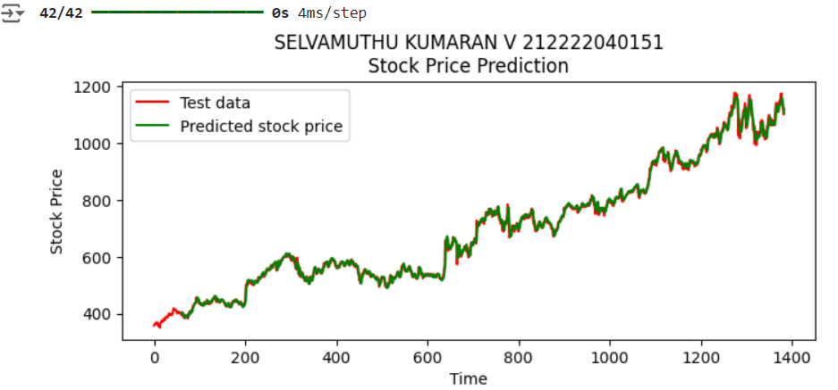
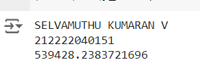

# Stock Price Prediction

## AIM

To develop a Recurrent Neural Network model for stock price prediction.

## Problem Statement and Dataset
The given problem is to predict the google stock price based on time.For this we are provided with a dataset which contains features like Date,Opening Price,Highest Price,Lowest Price,Closing Price,Adjusted Closing,Price and Volume.Based on the given features, develop a RNN model to predict the price of stocks in future

## Design Steps

### Step 1:
Import the required packages

### Step 2:
Load the dataset

### Step 3:
Perform the necessary data preprocessing

### Step 4:
Build and fit the data in the Learning model

### Step 5:
Predict using the fit model

### Step 6:
Check the error value of the predicted pricing model


## Program
#### Name:SELVAMUTHU KUMARAN V
#### Register Number:212222040151

``` python 
import numpy as np
import matplotlib.pyplot as plt
import pandas as pd
from sklearn.preprocessing import MinMaxScaler
from keras import layers
from keras.models import Sequential

dataset_train = pd.read_csv('trainset.csv')

dataset_train.columns

dataset_train.head()

train_set = dataset_train.iloc[:,1:2].values

type(train_set)

train_set.shape
sc = MinMaxScaler(feature_range=(0,1))
training_set_scaled = sc.fit_transform(train_set)

training_set_scaled.shape

X_train_array = []
y_train_array = []
for i in range(60, 1259):
  X_train_array.append(training_set_scaled[i-60:i,0])
  y_train_array.append(training_set_scaled[i,0])
X_train, y_train = np.array(X_train_array), np.array(y_train_array)
X_train1 = X_train.reshape((X_train.shape[0], X_train.shape[1],1))

X_train.shape

length = 60
n_features = 1

model = Sequential()
model.add(layers.SimpleRNN(50,input_shape=(length,n_features)))
model.add(layers.Dense(1))
model.compile(optimizer='adam', loss='mse')

model.summary()

model.fit(X_train1,y_train,epochs=100, batch_size=32)

dataset_test = pd.read_csv('testset.csv')

test_set = dataset_test.iloc[:,1:2].values
test_set.shape

dataset_total = pd.concat((dataset_train['Open'],dataset_test['Open']),axis=0)

inputs = dataset_total.values
inputs = inputs.reshape(-1,1)
inputs_scaled=sc.transform(inputs)
X_test = []
for i in range(60,1384):
  X_test.append(inputs_scaled[i-60:i,0])
X_test = np.array(X_test)
X_test = np.reshape(X_test,(X_test.shape[0], X_test.shape[1],1))

X_test.shape

predicted_stock_price_scaled = model.predict(X_test)
predicted_stock_price = sc.inverse_transform(predicted_stock_price_scaled)

print("Name:SELVAMUTHU KUAMRAN V  Register Number: 212222040151")
plt.plot(np.arange(0,1384),inputs, color='red', label = 'Test(Real) Google stock price')
plt.plot(np.arange(60,1384),predicted_stock_price, color='blue', label = 'Predicted Google stock price')
plt.title('Google Stock Price Prediction')
plt.xlabel('Time')
plt.ylabel('Google Stock Price')
plt.legend()
plt.show()

from sklearn.metrics import mean_squared_error
mse = mean_squared_error(y_test, predicted_stock_price)
print('Name:SELVAMUTHU KUAMRAN V \nReg no:212222040151')
print(f"Mean Squared Error: {mse}")
```

## Output

### True Stock Price, Predicted Stock Price vs time



### Mean Square Error



## Result

Thus a Recurrent Neural Network model for stock price prediction is done.